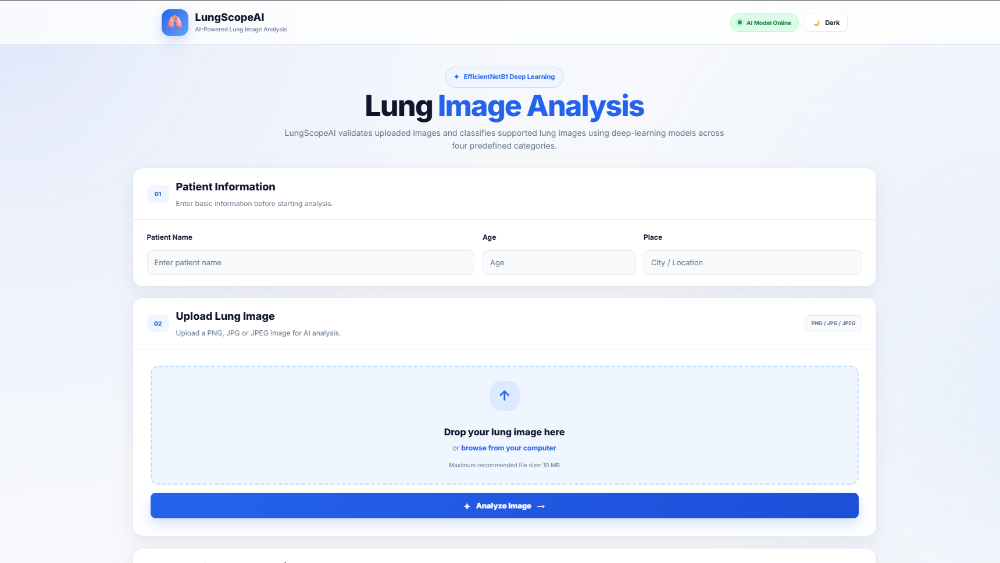
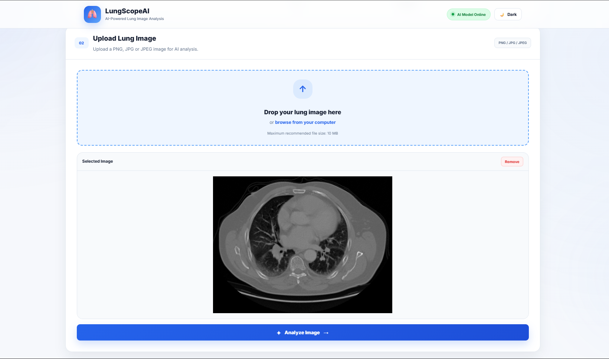
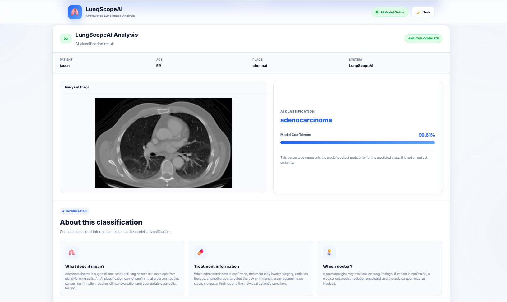
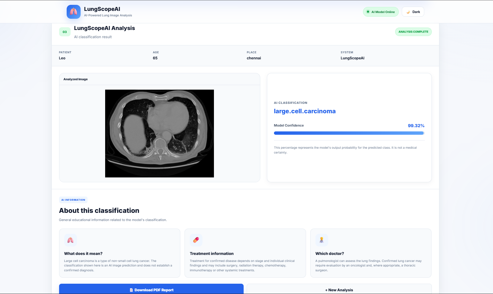
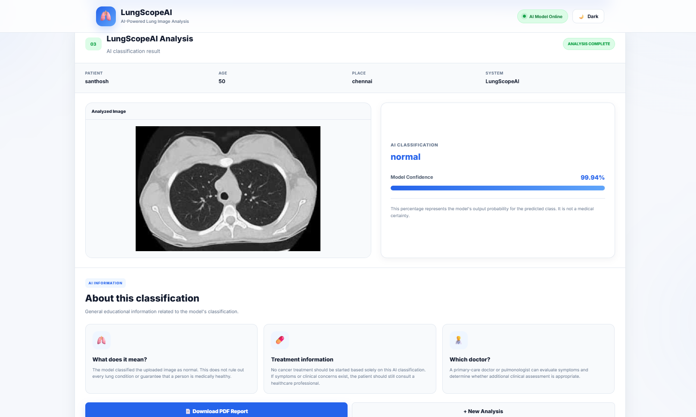
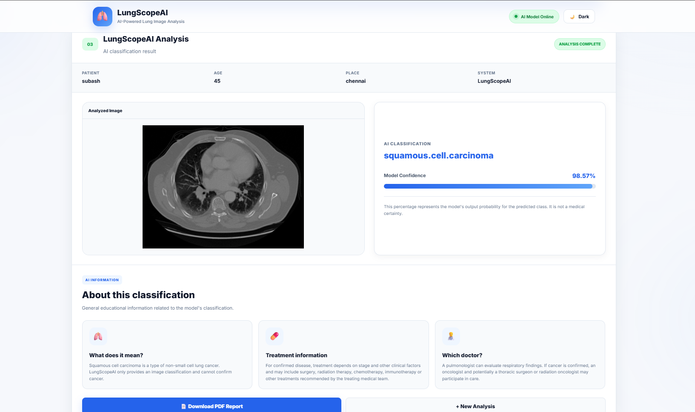
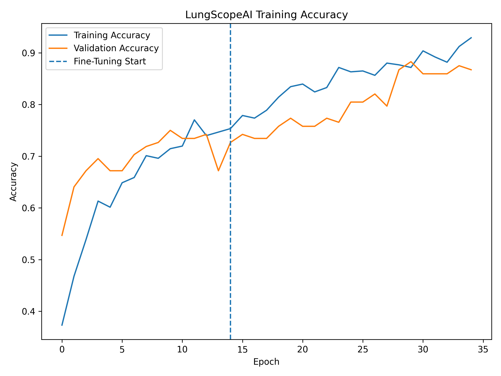
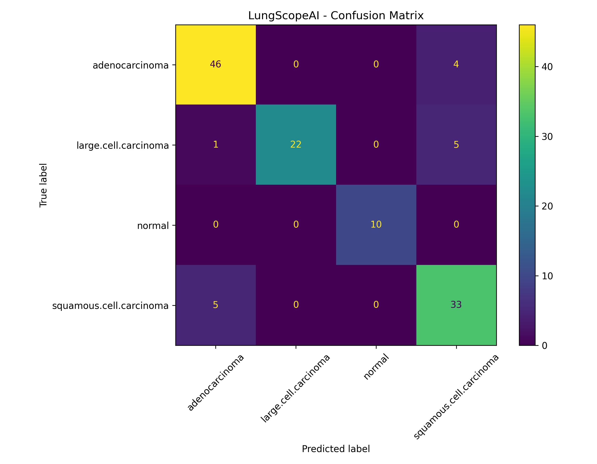

# 🫁 LungScopeAI – Lung Cancer Classification Using CT Scan Images

A Deep Learning web application that classifies lung CT scan images into four categories using **EfficientNetB1** and **Flask**.

---

## 📌 Project Overview

This project uses Transfer Learning with **EfficientNetB1** to classify lung CT scan images into four classes:

* Adenocarcinoma
* Large Cell Carcinoma
* Normal
* Squamous Cell Carcinoma

The trained model is deployed as a Flask web application where users can upload a CT scan image and receive the predicted class along with a confidence score.

The final model was trained and evaluated using a cleaned dataset with separate training, validation, and testing splits.

> **Note:** This project is developed for educational and research purposes. It is not intended to provide medical diagnosis or replace professional medical advice.

---

## 🚀 Features

* Deep Learning-based Lung CT Image Classification
* EfficientNetB1 Transfer Learning
* Flask Web Application
* CT Scan Image Upload
* Four-Class Classification
* Disease/Category Prediction
* Confidence Score Display
* Data Validation
* Accuracy and Loss Analysis
* Confusion Matrix
* Classification Report
* Model Evaluation

---

## 🛠 Technologies Used

* Python
* TensorFlow
* Keras
* EfficientNetB1
* Flask
* NumPy
* Pillow
* Matplotlib
* Scikit-learn
* HTML5
* CSS3
* Gunicorn

---

## 📂 Dataset Structure

The cleaned dataset is divided into training, validation, and testing sets.

```text
dataset_clean_resplit/

│
├── train/
│   ├── adenocarcinoma
│   ├── large.cell.carcinoma
│   ├── normal
│   └── squamous.cell.carcinoma
│
├── valid/
│   ├── adenocarcinoma
│   ├── large.cell.carcinoma
│   ├── normal
│   └── squamous.cell.carcinoma
│
└── test/
    ├── adenocarcinoma
    ├── large.cell.carcinoma
    ├── normal
    └── squamous.cell.carcinoma
```

### Dataset Distribution

| Split      |  Images |
| ---------- | ------: |
| Training   |     592 |
| Validation |     128 |
| Testing    |     126 |
| **Total**  | **846** |

---

## 📁 Project Structure

```text
LungScopeAI/

│
├── app.py
├── predict.py
├── evaluate.py
├── README.md
├── requirements.txt
├── Procfile
│
├── models/
│   ├── best_b1_model.keras
│   └── lung_ct_validator.keras
│
├── templates/
│   └── index.html
│
└── static/
    ├── style.css
    └── uploads/
```

The production application uses:

```text
models/best_b1_model.keras
```

as the main classification model.

The CT image validation model is:

```text
models/lung_ct_validator.keras
```

Training datasets and experimental models are maintained separately and are not required for the production web application.

---

## ⚙️ Installation

### Clone Repository

```bash
git clone https://github.com/DhayalanSD/LungScopeAI.git
```

### Open Project

```bash
cd LungScopeAI
```

### Create Virtual Environment

```bash
python -m venv venv
```

### Activate Virtual Environment

Windows:

```powershell
venv\Scripts\activate
```

### Install Dependencies

```bash
pip install -r requirements.txt
```

---

## ▶ Train Model

The project includes training scripts for model development and experimentation.

```bash
python train.py
```

The final production model was developed using EfficientNetB1 with transfer learning, class weighting, data augmentation, and fine-tuning.

---

## 📊 Evaluate Model

The model can be evaluated using:

```bash
python evaluate.py
```

The final EfficientNetB1 model was evaluated on a clean held-out test set.

---

## 🔍 Predict Single Image

For testing a single CT scan image:

```bash
python predict.py "path/to/image.png"
```

The production classifier uses:

```text
models/best_b1_model.keras
```

---

## 🌐 Run Flask Application

Start the Flask application:

```bash
python app.py
```

Open your browser and visit:

```text
http://127.0.0.1:5000
```

Users can upload a CT scan image through the web interface and receive the predicted class and confidence score.

---

## 📈 Model Performance

The final model uses **EfficientNetB1** and was evaluated on the clean held-out test set containing **126 images**.

| Metric              |          Value |
| ------------------- | -------------: |
| Model               | EfficientNetB1 |
| Image Size          |  224 × 224 × 3 |
| Classes             |              4 |
| Test Images         |            126 |
| Correct Predictions |      121 / 126 |
| Test Accuracy       |     **96.03%** |
| Test Loss           |     **0.1762** |
| Macro F1-Score      |     **0.9686** |
| Weighted F1-Score   |     **0.9604** |

### Classification Report

| Class                   | Precision | Recall | F1-Score |
| ----------------------- | --------: | -----: | -------: |
| Adenocarcinoma          |    0.9412 | 0.9600 |   0.9505 |
| Large Cell Carcinoma    |    1.0000 | 0.9286 |   0.9630 |
| Normal                  |    1.0000 | 1.0000 |   1.0000 |
| Squamous Cell Carcinoma |    0.9487 | 0.9737 |   0.9610 |

### Confusion Matrix

```text
                         Predicted
                    Adeno  Large  Normal  Squamous

Actual Adeno          48      0       0       2
Actual Large           2     26       0       0
Actual Normal          0      0      10       0
Actual Squamous        1      0       0      37
```

---

## 📷 Project Screenshots

### Home Page



---

### Analyze Image



---

### Prediction Result

### 🧬 Adenocarcinoma Prediction


### 🧬 Large Cell Carcinoma Prediction


### ✅ Normal Prediction


### 🧬 Squamous Cell Carcinoma Prediction


---

### Accuracy Graph



---

### Confusion Matrix



---

## 🌐 Deployment

The application is configured for deployment using **Gunicorn**.

### Procfile

```text
web: gunicorn app:app 
```

The application can be deployed on platforms such as **Render** that support Python web applications.

---

## 📌 Future Improvements

* Improve model interpretability
* Add Grad-CAM visualization
* Support additional lung conditions
* Expand the dataset
* Add user authentication
* Store prediction history
* Add prediction analytics
* Improve deployment scalability
* Add additional validation techniques

---

## ⚠️ Disclaimer

LungScopeAI is an **educational and research project**. The predictions generated by this application are not medical diagnoses and should not be used as a substitute for evaluation by a qualified healthcare professional.

---

## 👨‍💻 Author

**Dhayalan**

B.Tech Artificial Intelligence & Machine Learning

GitHub: https://github.com/DhayalanSD

Portfolio: https://dhayalan-b.vercel.app/

---

## ⭐ If you like this project

Please give this repository a ⭐ on GitHub.
